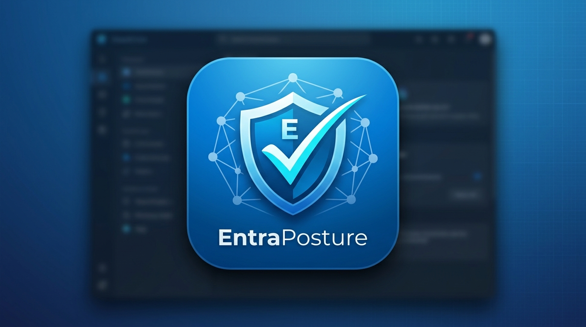

<p align="center">
  
</p>

# EntraPosture

A native PowerShell 7.4+ module that assesses a Microsoft Entra ID (and optionally Azure RBAC)
tenant's security posture: collects evidence read-only over Microsoft Graph/ARM, seals it into a
tamper-evident bundle, evaluates it offline against a native control registry, and renders the
result as HTML, JSON, CSV, and console output.

No client secrets, no telemetry, no external dependencies, no write operations against your
tenant, and every rendered report is safe to open with no network access at all. See
[`docs/SecurityAndStorage.md`](docs/SecurityAndStorage.md) for the specifics behind each of those
claims.

## Requirements

- PowerShell 7.4 or later (Windows, macOS, or Linux).
- An Entra app registration in the tenant you're assessing, with either:
  - a **certificate** uploaded for app-only (unattended) authentication, or
  - a **Mobile and desktop applications** redirect URI of `http://localhost` for delegated
    (interactive) authentication.
- No client secret, ever -- this tool has no code path that accepts one.

See [`docs/PermissionMatrix.md`](docs/PermissionMatrix.md) for the exact Graph/ARM permissions to
grant. A narrower grant doesn't block the run -- it produces a `Partial` result with specific,
named gaps, never a silent or misleading "clean" report.

## Why an app registration, and why not skip it

Every Microsoft Entra OAuth token -- delegated or app-only, no exception -- is issued to some
registered application. There's no code path anywhere in Microsoft's identity platform that
issues a Graph token tied only to a signed-in user's own directory role (e.g. Global Reader) with
no application in the picture at all. If you're hoping to skip app registration setup entirely,
that specific thing isn't achievable no matter which tool you use.

**What actually varies between tools is *whose* application identity gets used.** This tool
requires you to register your own -- deliberately, as an architecture decision (see
`src/Authentication/DelegatedAuth.ps1`'s own `-ClientId` parameter documentation), not because a
lighter option was overlooked.

**The alternative some tools take instead: silently reusing a Microsoft first-party application's
client ID** (Azure Portal, Azure CLI, Microsoft Graph PowerShell, etc.), which is usually already
pre-consented in a tenant, to skip registration and consent entirely. This project's own research
into EntraFalcon (a comparable community tool) found it does exactly this: its default `BroCi`
auth flow reuses a *stored refresh token* for the Azure Portal's own client ID
(`c44b4083-3bb0-49c1-b47d-974e53cbdf3c`) to make its Graph data-collection calls.

**This tool explicitly rejects that pattern.** Not as caution for its own sake -- for three
concrete reasons:

1. **It bypasses admin consent review.** The tenant admin consented to *Azure Portal* doing
   Azure-Portal things. They never reviewed or approved *this specific tool* reading role
   assignments, group membership, and Conditional Access policies -- the token just rides on
   trust extended to something else entirely.
2. **It breaks attribution.** Sign-in logs, Conditional Access evaluation, and risk detection
   would all show the activity as "Azure Portal" (or whichever identity was borrowed), not as
   this tool. You lose the ability to tell a real audit trail apart from this tool's own activity.
3. **It's a known phishing technique**, not a theoretical concern -- attackers reuse trusted
   first-party client IDs specifically to avoid triggering a consent prompt a victim might
   scrutinize. A security assessment tool normalizing that pattern, even used benignly, legitimizes
   exactly the thing it should be flagging if it saw another tool do it.

**In practice, this costs you a few minutes, once, for the whole organization** -- not per run,
not per user. Once your app registration exists, every subsequent run by any Global-Reader-or-above
user reuses it. `scripts/New-AppRegistration.ps1` automates that one-time step using **Azure CLI**
(`az login` / `az ad app create`) -- worth being precise about why *this* is fine when reusing a
first-party client ID inside the tool itself is not: `az login` is you, explicitly and
transparently, using a real Microsoft admin tool for exactly the purpose it exists for (managing
your own tenant), with sign-in activity accurately attributed to "Azure CLI" because that's
genuinely what's running. It's a one-time, visible, user-initiated administrative action -- not
this tool's own code silently borrowing an identity to make its *ongoing* data-collection calls
untraceable.

```powershell
# One-time, per organization -- requires Azure CLI (brew install azure-cli / apt/winget) and
# a sign-in with rights to create app registrations and grant admin consent.
./scripts/New-AppRegistration.ps1 -TenantId '<tenant-id>'
```

This creates the app registration, sets the `http://localhost` redirect URI delegated auth needs,
adds the 12 required Graph permissions (resolved dynamically by name against Microsoft Graph's own
current scope list, not hardcoded GUIDs), and grants admin consent -- printing the resulting
Application (client) ID for you to use in every command below.

## Quick start

### 1. Build the module

```powershell
./build/Build-Module.ps1
Import-Module ./dist/EntraPosture.psd1
```

### 2. Check access before collecting anything

```powershell
Test-EntraPostureAccess -TenantId '<tenant-id>' -ClientId '<app-client-id>' -AuthMode Delegated
```

This opens your browser to sign in, then reports which permissions actually came back on the
token -- no data is collected yet.

### 3. Run a full assessment

```powershell
$run = Invoke-EntraPosture -TenantId '<tenant-id>' -ClientId '<app-client-id>' `
    -AuthMode Delegated -RunRoot ./runs

$run.ExitCode          # see the exit-code table below
$run.HtmlReportPath     # open this in any browser, works offline
```

For unattended/certificate auth, add `-AuthMode Certificate -Certificate $cert` (an already-loaded
`X509Certificate2` object -- this tool never reads a `.pfx` file or handles its password itself).

For Azure RBAC collection too, add `-ArmScope '/subscriptions/<id>'` (or a management-group scope)
-- omitted entirely by default, not silently attempted and failed.

### 4. Compare two runs over time

```powershell
Compare-EntraPosture -OldAssessmentPath $oldRun.AssessmentPath -NewAssessmentPath $run.AssessmentPath
```

Reports exactly what changed: control result transitions, added/removed findings, coverage
changes, and deviation changes -- each classified separately, never conflated.

## Helper scripts

Ad hoc operator tooling under `scripts/` -- not part of the shipped module (not in
`build/BuildManifest.psd1`, not exported), saved copies of commands built during real usage
rather than something to retype each time:

| Script | Purpose |
|---|---|
| `New-AppRegistration.ps1` | One-time app registration bootstrap via Azure CLI -- see above. |
| `Connect-Tenant.ps1` | Quick access-check or full run against a real tenant, delegated or certificate auth, prints per-collector status. |
| `Compare-WhatIf.ps1` | Runs this tool's offline CA simulation and Microsoft's real live What-If API against the same scenario, side by side. |

## Exit codes

| Code | Meaning |
|---|---|
| 0 | Success -- no unapproved failures, full or partial-but-acceptable coverage |
| 2 | At least one unapproved `Fail` (or, with `-Strict`, any `Fail` at all regardless of an approved deviation) |
| 3 | Partial assessment -- required evidence wasn't fully collected, independent of whether the controls that did run would have passed |
| Other | An operational failure (authentication, collection, or evaluation/report itself threw) -- see the returned object's `Error` field |

## What each run produces

- `staging-<id>/` -- the sealed **snapshot**: raw-normalized tenant evidence, hash/signature
  integrity record.
- `assessment-<id>/` -- the sealed **assessment**: control results, deviations, and (once
  rendered) `reports/assessment.json`, `report.html`, `findings.csv`, `summary.txt`.

Neither bundle is ever deleted automatically -- see
[`docs/SecurityAndStorage.md`](docs/SecurityAndStorage.md) for retention guidance.

## Documentation

- [`docs/PermissionMatrix.md`](docs/PermissionMatrix.md) -- exact permissions per collector, ARM
  requirements, known coverage gaps.
- [`docs/SecurityAndStorage.md`](docs/SecurityAndStorage.md) -- credential handling, network
  behavior, storage/retention, redaction, integrity guarantees.
- [`docs/Building.md`](docs/Building.md) -- building the module from source.
- [`docs/VNext.md`](docs/VNext.md) -- what's deliberately deferred beyond this release, and why.
- [`NOTICE.md`](NOTICE.md) -- third-party notices.
- [`sbom.json`](sbom.json) -- software bill of materials.

Deep engineering detail (every phase's real bugs found and fixed, every scope decision and why)
lives in this project's own `00-open-questions.md` working log, maintained continuously across
every phase of development -- the single most complete record of *why* this tool is built the way
it is.

## Known limitations as of this release

- Azure RBAC is discovery-only unless `-ArmScope` is supplied; no control currently evaluates it
  directly.
- 6 of 17 designed agent-identity findings remain unbuilt: `AGT-002`/`003`/`006`/`007` (need a
  separately-scoped decision on whether "extensive API privilege" belongs to agent identities
  specifically or to a general service-principal-permission-risk control) and `AGT-010`/`016`
  (blocked on an inactivity-threshold evidence gap -- no sign-in-log domain exists yet). See
  [`docs/VNext.md`](docs/VNext.md) for the full design record.
- `AGT-015`'s evidence collection is delegated-only -- Microsoft's own `ownedObjects` endpoint has
  no application-permission path at all -- so it's structurally `NotEvaluated` under
  `-AuthMode Certificate`, independent of granted permissions.
- ~125 rows of the broader EntraFalcon/Conditional Access Validator feature-parity matrix remain
  uncatalogued as native controls -- a mix of controls needing genuinely new evidence collection
  and lower-confidence candidates pending field-capture verification. See
  [`docs/VNext.md`](docs/VNext.md) for the tracked backlog.
- Live What-If comparison (`scripts/Compare-WhatIf.ps1`) requires the tenant to be licensed for
  Conditional Access (Entra ID P1+) -- confirmed to fail cleanly, not silently, against an
  unlicensed tenant.

58 native controls are built and shipped, including `AR-002` (access review instance health),
`AUTHCTX-001`/`002` (authentication context coverage and effectiveness), `CA-002` (full
combinatorial Conditional Access gap analysis, generalizing beyond `CA-001`'s bounded 16-scenario
grid), `EM-001`/`EM-002` (entitlement management), the full `PIM-002` through `PIM-009` set, 11
agent-identity findings (`AGT-001`, `004`, `005`, `008`, `009`, `011`-`015`, `017`), PIM-for-Groups
(`PIMG-001`/`002`), 10 Conditional Access policy-shape checks (`CAP-001`-`010`), 3 guest/external
collaboration checks (`COL-001`/`002`), foreign/internal enterprise application and managed
identity role-holding checks (`ENT-006`/`007`/`011`/`012`, `MAI-002`/`003`), and hybrid-identity/
app-registration-secret checks (`USR-007`/`008`, `APP-001`). Conditional Access drift detection
(`Compare-EntraPosture`), named-location resolution, device-filter rule-language evaluation, and
workload-identity sign-in scenarios are also built.

See [`docs/VNext.md`](docs/VNext.md) for the complete build log and what's still deferred.
